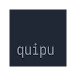

# Quipu



Quipu is a simple [Pinboard](http://pinboard.in) powered session manager.

[Add to Chrome](https://chrome.google.com/webstore/detail/quipu/ekiaicefngglagjldocoldkinmhegnjo)

<!-- [Add to Firefox]() -->

I have too many tabs open. I struggle to keep them organised. If I have to switch context, I often keep a group of tabs related to a topic open, or I save them in an email, or a slack message or a variety of different bookmarking services, and lose them. I fear my browser crashing and losing work.

Quipu is a tool that allows me to save some tabs for later, arranged in a simple, two level hierarchy. It doesn't require me to spend too much time curating them, but it does make saving and having them available quickly.

Quipu uses pinboard tags to organise tabs in pages and cards. A bookmark can appear in multiple pages and cards, if it is so tagged. Pages and cards provide no formal structure, they are for the user's visual convenience only. Bookmarks are ordered according to when they were saved.

The name [quipu](https://en.wikipedia.org/wiki/Quipu) comes from an andean record keeping – and perhaps writing – system, which organises information in strings and knots.


## Credits

Built with [Svelte](https://svelte.dev/) & [Tailwind](https://tailwindcss.com/), the fantastic [Iosevka](https://typeof.net/Iosevka/) typeface, drag and drop via [svelte-dnd-action](https://github.com/isaacHagoel/svelte-dnd-action)
scaffolding using [browser-extension-template](https://github.com/fregante/browser-extension-template)

## Contributing

This is a simple tool that I built because I need it. I would like to keep it simple, but if you find it and you like it, and have ideas on how to improve it, I'd love to hear them.

Some notes on how to get things running:

Install dependencies

```
$. npm install
```

Interactively build the extension for development

```
$. npm run watch
```

or just build it:

```
$. npm run build
```

You can load a temporary extension on both Firefox and Chrome by pointing them to the `manifest.json` file on the `/distribution` directory after you have built it.

Make sure that your code comforms to the lint settings

```
$. npm run lint
```
