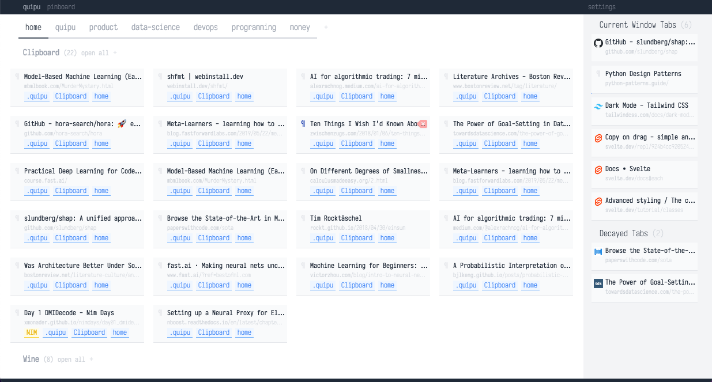

# Quipu

Quipu is a simple [Pinboard](http://pinboard.in) powered session manager.

I have too many tabs open. I struggle to keep them organised. I need a tool that allows me to save some bookmarks for later, in groups, but that doesn't require me to spend too much time curating them. I also want to have those sessions available quickly.

Quipu uses tags to organise bookmarks in tabbed pages and cards. A bookmark can appear in multiple pages and cards, if it is so tagged. Pages and cards provide no hierarchical structure, they are for the user's visual convenience only. Bookmarks are ordered according to when they were added.



## Credits

Built with [Svelte](https://svelte.dev/) & [Tailwind](https://tailwindcss.com/), the fantastic [Iosevka](https://typeof.net/Iosevka/) typeface, drag and drop via [svelte-dnd-action](https://github.com/isaacHagoel/svelte-dnd-action)
scaffolding using [browser-extension-template](https://github.com/fregante/browser-extension-template)

## Contributing

This is a simple tool that I built because I need it. I would like to keep it simple, but if you find it and you like it, and have ideas on how to improve it, I'd love to hear them.

Some notes on how to get things running:

Install dependencies

```
$. npm install
```

Interactively build the extension for development

```
$. npm run watch
```

or just build it:

```
$. npm run build
```

You can load a temporary extension on both Firefox and Chrome by pointing them to the `manifest.json` file on the `/distribution` directory after you have built it.

Make sure that your code comforms to the lint settings

```
$. npm run lint
```
